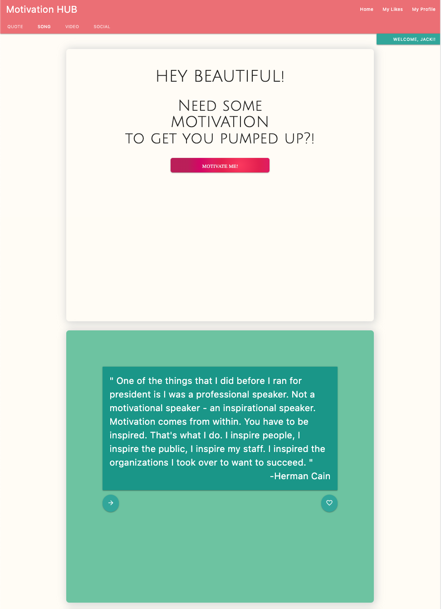
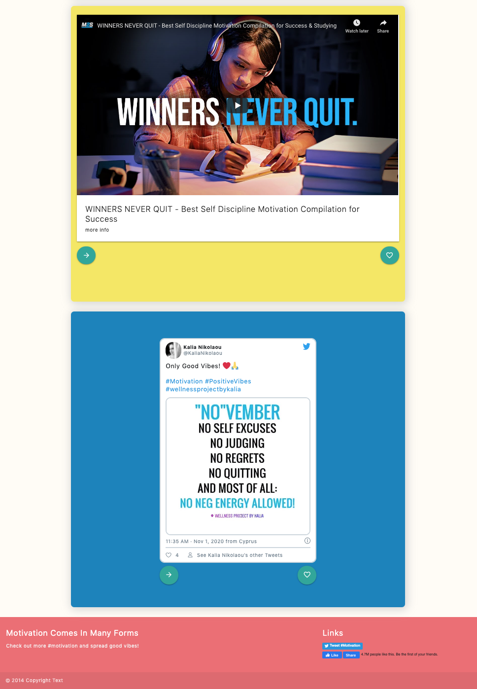
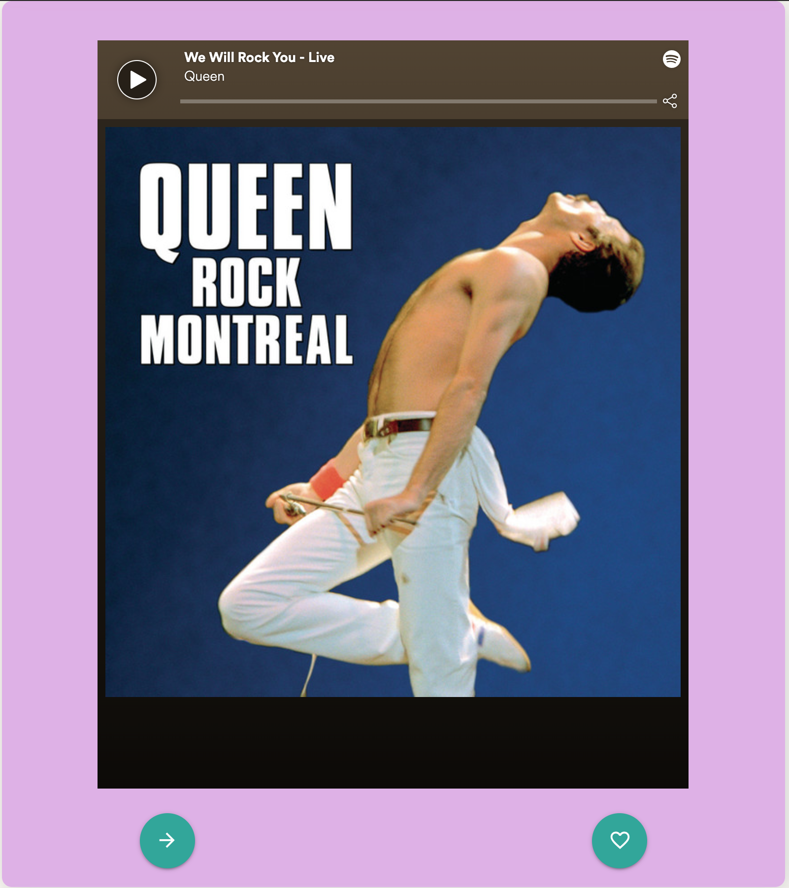
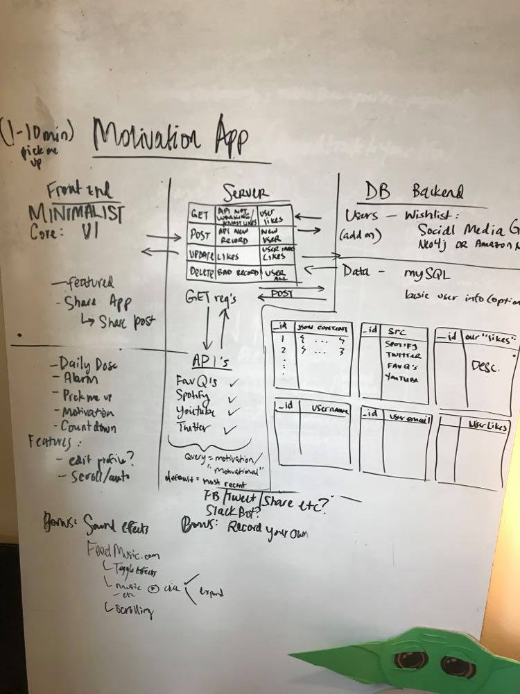

# Hi, I'm Jacki

I love coding, spreading positivity and hearing feedback! Feel free to connect, send feedback or submit a PR with really cool ideas :)

# MVP
Motivation HUB
Motivation App for your daily inspiration to get at it.  Enjoy quotes, songs, video clips and social posts :)

Note: Motivation HUB currently in development. Here is a sneak peek to what is to come:

## Getting Started
Clone the Github repository:
* `$ git clone https://github.com/day-glow/MVP.git`

Navigate inside of the directory `./MVP` and run the following commands:
1. `$ npm install`
2. `$ npm run build`
3. `$ npm start`

Open a new browser tab to see the app:
* `http://localhost:3000`

Note: Current videos are samples. Must add new API keys/tokens for all media sources to populate with new data. Please review "Add API's" section of this ReadMe.

## API's
* FavQ's.com
* Spotify
* Youtube
* Twitter

## Add API's
The current repo has 4 API's it is pulling from in the server. You must add your registered API keys/tokens in order to utilize these features. Navigate to this repo's `./config` folder to find the templates for each API (i.e. `youtube_example_api.js`). Register for your personal API keys at the following sites, and replace the templates with your new API keys.

- [ ] FavQ's.com API: ( https://favqs.com/api_keys )
- [ ] Spotify API: ( https://developer.spotify.com/documentation/web-api/ )
- [ ] Youtube API: ( https://developers.google.com/youtube/v3 )
- [ ] Twitter API v2: ( https://developer.twitter.com/en/docs/twitter-api )

Once completed refresh the page. If there is no change, `Ctrl + C` in terminal windows and rerun the following commands:
1. `$ npm run build`
2. `$ npm start`

## Using Motivation HUB
Each section is dedicated to quotes, songs, videos or social feeds. Users can like a content piece and save them to their likes to revisit at a later time.

Click the right arrow button to see next piece of content.

Click on the content to link to the original content source.

## Whiteboarding Database

## Built With
* React
* Node.js
* Express
* mySQL
* Sequelize
* Wepack
* Materialize CSS
